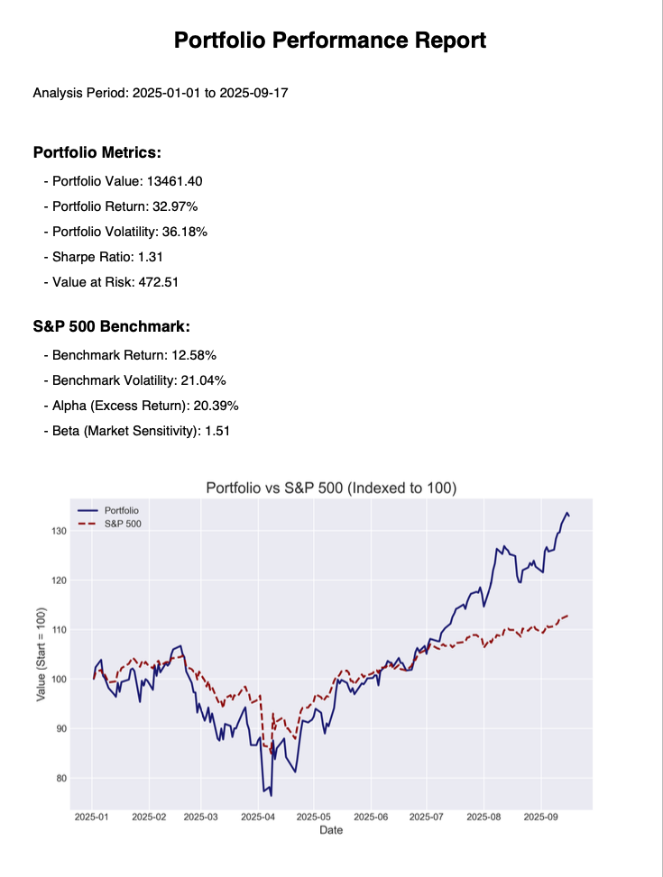

# Portfolio Performance & Reporting Tool

A Python-based tool that analyzes a stock portfolio's performance, compares it to the S&P 500 benchmark, and generates a comprehensive PDF report. This project demonstrates skills in data analysis with Pandas and NumPy, API integration for data fetching, and automated report generation.

## Features
- Ingests a simple CSV file defining a stock portfolio.
- Fetches historical market data from Yahoo! Finance, including the S&P 500 (^GSPC) benchmark.
- Calculates key performance metrics:
  - Total Return
  - Annualized Volatility (Risk)
  - Sharpe Ratio (Risk-Adjusted Return)
  - Value at Risk (VaR)
  - Alpha (Excess Return vs S&P 500)
  - Beta (Portfolio Sensitivity to S&P 500)
- Generates a PDF report with:
  - Portfolio metrics
  - Benchmark metrics
  - Alpha & Beta
  - Relative performance chart (Portfolio vs S&P 500, indexed to 100 at start)

## Technologies Used
- Python 3.11
- Pandas
- NumPy
- yfinance
- FPDF2
- Matplotlib

## Setup and Usage
1. **Clone the repository:**
    ```bash
    git clone https://github.com/atrbyg24/portfolio-reporting.git
    cd portfolio-analyzer
    ```

2. **Create a virtual environment and install dependencies:**
    ```bash
    python -m venv venv
    source venv/bin/activate  # On Windows, use `venv\Scripts\activate`
    pip install -r requirements.txt
    ```

3. **Customize your portfolio:**
    Edit the `portfolio.csv` file to include your desired stock tickers and share counts.

4. **Run the application:**
    ```bash
    python src/main.py
    ```
    A report named `Financial_Report.pdf` will be generated in the root directory, including portfolio metrics, benchmark comparison, alpha, beta, and a relative performance chart.

## Example Output

